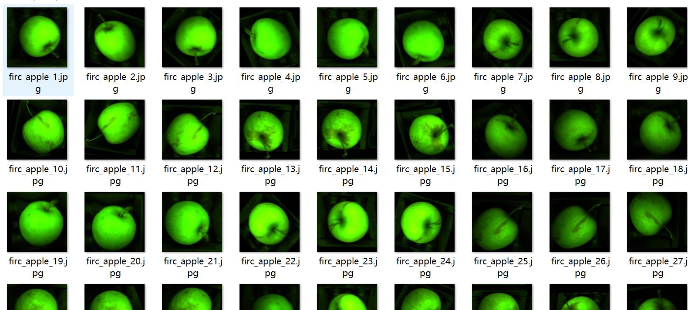
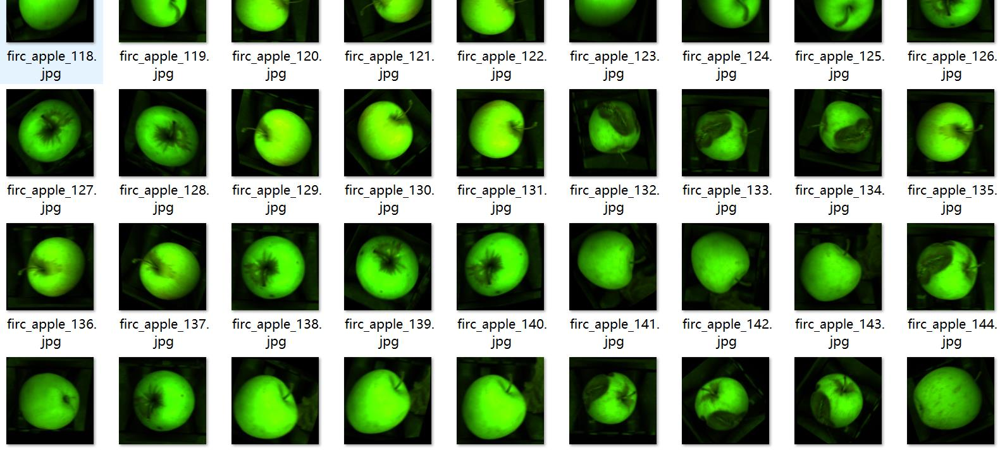
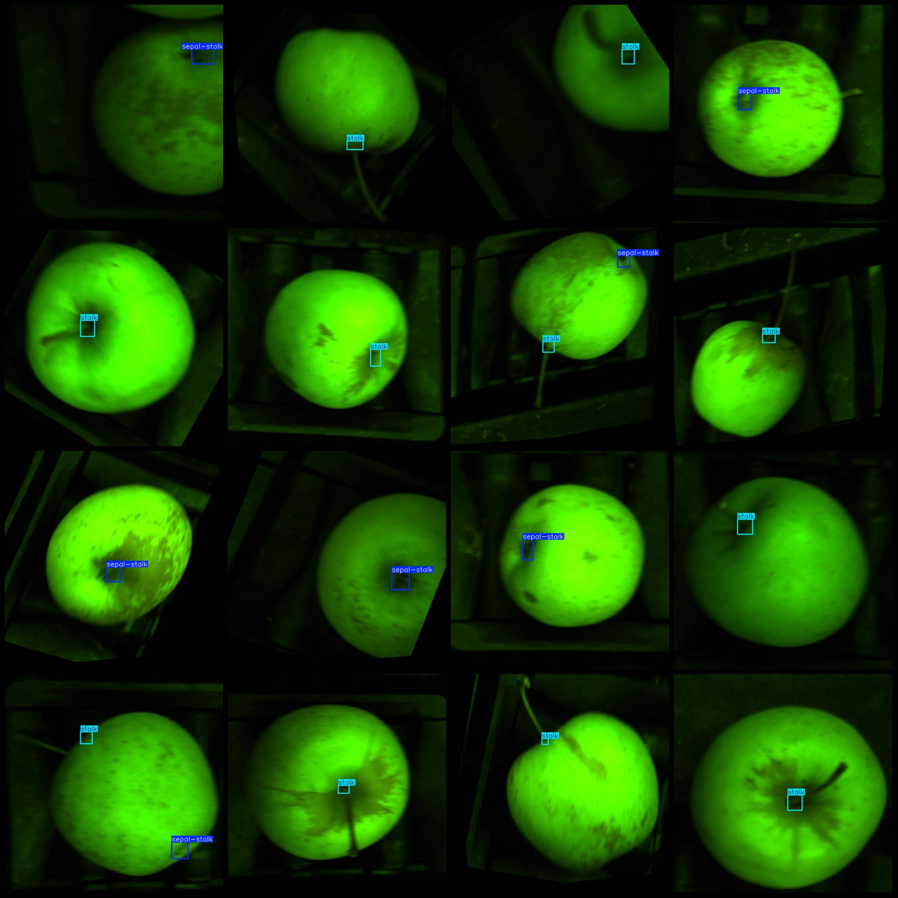
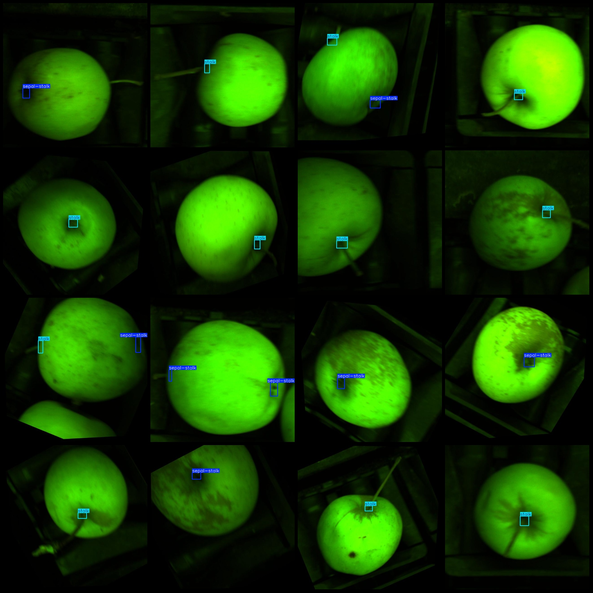

# Apple Bud Detection Dataset VOC+YOLO Format with 1141 Images in 2 Classes with Enhanced Generation

Please note that approximately 450 images are original, while the remaining are enhanced.
The dataset format is Pascal VOC format plus YOLO format (excluding the split path's txt file, only containing jpg images along with corresponding VOC and YOLO format xml files).
The number of images (jpg file count): 1141.
The number of annotations (xml file count): 1141.
The number of annotations (txt file count): 1141.
The number of annotation categories: 2.
The number of annotation categories names (note that the order of classes in the YOLO format does not correspond to this, but refer to the "classes.txt" in the labels folder for consistency): 
["sepal-stalk", "stalk"].
Each category of annotations has a number of bounding boxes:
- sepal-stalk (opposite flower stalk) = 467.
- stalk (flower stalk) = 820.
Total bounding box count: 1287.
Each category occupies a number of images:
- sepal-stalk occupies images = 464.
- stalk occupies images = 820.
Image resolution: 640x640.
Annotation tool used: labelImg.
Annotation rules: draw bounding boxes for each class.
Important note: The dataset does not have separate training, validation, or test sets; they must be manually divided.
Special statement: This dataset does not guarantee any accuracy in the models trained on it or the weight files.
Image preview:
Annotation examples:

## Images

Here is a pay link on Stripe ( https://buy.stripe.com/3cs8yP7sY87d0vu9AB ). Please contact me lonlonago@foxmail.com after funding $89, and I will send you a complete data files , thank you!

